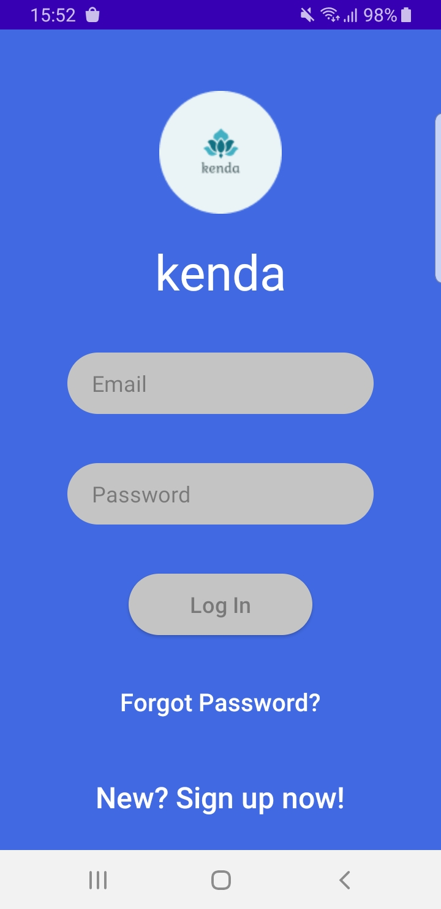
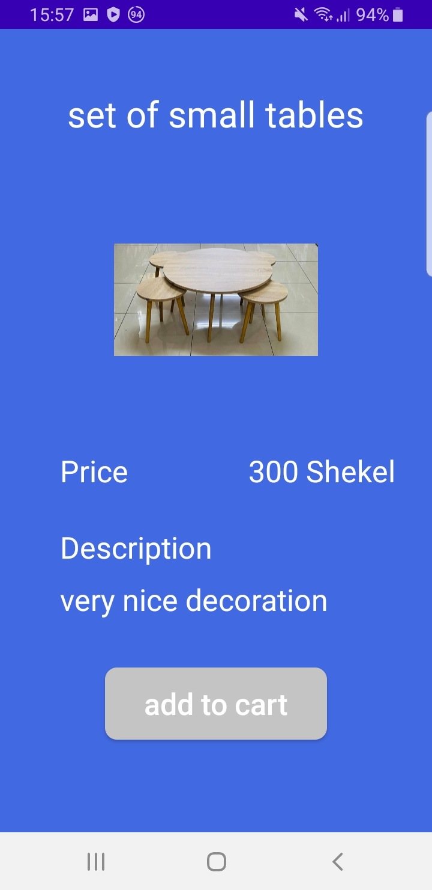
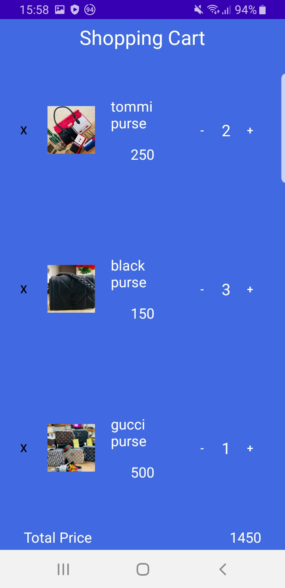

# kenda_app

An android application that was developed using Java in the android studio ide.

The application is an online shop, each customer can log in using his account.

Features in the app:

1- Sign up & Log in.

2- Reset the password.

3- Uploading profile picture.

4- Using firebase as database.

5- Sending the order to the seller within a click.

## Home Screen

## Home Screen

## Home Screen

## Home Screen

## Home Screen

## Home Screen

## Home Screen

## Home Screen

## Home Screen

## Home Screen

